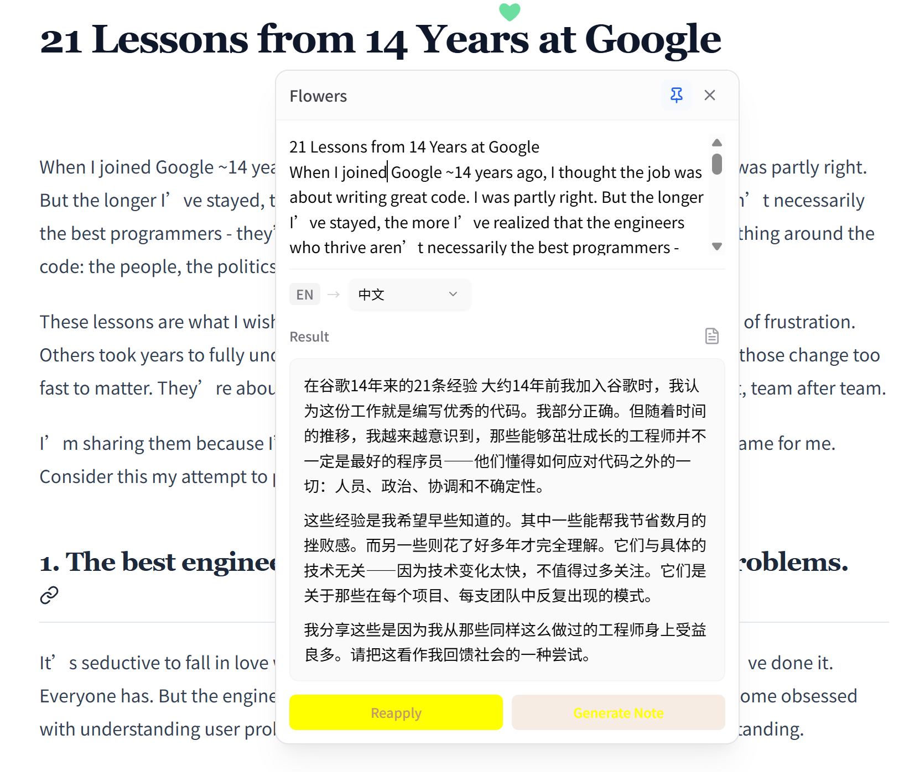
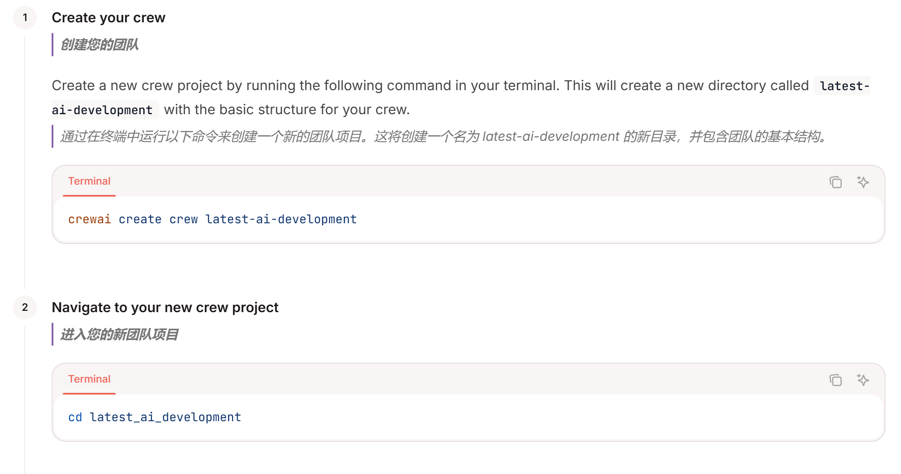
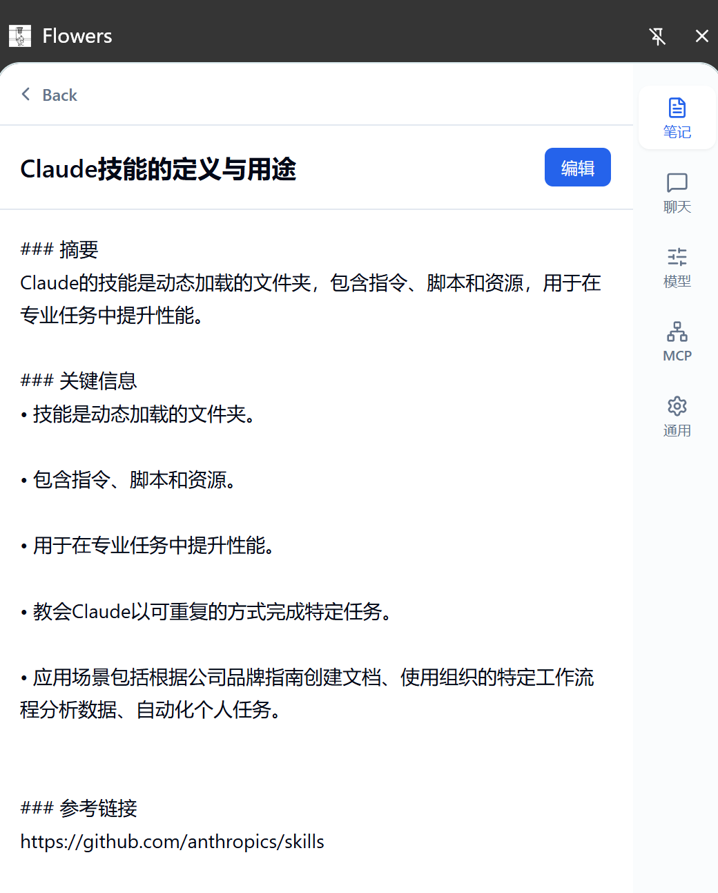

# 🌸 Flowers

<div align="center">

**An intelligent browser extension for AI-powered translation, polishing, note-taking, and knowledge management**

[](./LICENSE)
[]()
[](https://www.typescriptlang.org/)
[](https://react.dev/)
[](https://nodejs.org/)

[English](./README.md) | [简体中文](./README.zh-CN.md)

</div>

---

## 📺 Demo

<div align="center">
  <video src="https://github.com/user-attachments/assets/6f4cb81d-d683-4c5d-8e07-0e6bf19d7fde" width="100%" controls autoplay loop muted></video>
  <p><i>Experience the seamless AI-powered workflow of Flowers</i></p>
</div>

---

## ✨ Features

### 🎯 Core Capabilities

| Feature | Description |
|---------|-------------|
| 🌐 **Smart Translation** | Context-aware translation with editable terminology |
| ✨ **AI Polish** | Professional text refinement with multiple tone options |
| 📝 **Note Generation** | Auto-generate structured notes from web content |
| 💬 **RAG-Powered Chat** | Ask questions grounded in your personal knowledge base |
| 📄 **PDF Translation** | Select and translate text directly within PDF documents |
| 🎬 **Video Subtitle Translation** | Real-time AI translation of video subtitles (YouTube, etc.) |
| 🌐 **Full Page Translation** | Bilingual comparison mode with technical content protection |
| 🎨 **Customizable Prompts** | Edit and manage AI prompts for each workflow |

### 🚀 Highlights

- **Popup on Selection** - Instant AI tools when you highlight text
- **PDF Support** - Built-in PDF reader with full translation capabilities
- **Multi-Provider Support** - Connect to OpenAI, Ollama, DeepSeek, DashScope, Anthropic, Google, and more
- **Custom Prompts** - Full control over AI behavior for each workflow
- **Side Panel Workspace** - Integrated chat, notes, and settings
- **Local-First & Privacy** - All notes and settings stored locally. No data collection.

---

## 🔧 Flexible Configuration

> 💡 **The core strength of Flowers is its configurability.** Adapt the extension to your exact needs.

### Multi-Provider Support

Flowers supports a wide range of LLM providers out of the box:

| Provider | Type | Notes |
|----------|------|-------|
| **OpenAI** | Cloud | GPT-4o, GPT-4, GPT-3.5-turbo |
| **Ollama** | Local | Run models locally with full privacy |
| **DeepSeek** | Cloud | Cost-effective high-quality models |
| **DashScope** | Cloud | Alibaba Cloud Qwen models |
| **Anthropic** | Cloud | Claude models |
| **Google** | Cloud | Gemini models |
| **Any OpenAI-Compatible** | Custom | LM Studio, vLLM, LocalAI, etc. |

**Configuration is simple:**

1. Go to **Settings** → **Model Configuration**
2. Add a new provider with Base URL, API Key, and model list
3. Select your preferred Chat Model and Embedding Model
4. Save and start using!

### Custom Prompts

Every AI workflow (Translation, Polish, Note Generation, Chat) uses customizable system prompts:

- **Edit prompts** to match your domain or writing style
- **Language-aware switching** ensures output matches your UI language
- **Full prompt visibility** - see exactly what the AI receives

Go to **Settings** → **Prompt Management** to customize.

---

## 📸 Screenshots

> 💡 **Tip**: Watch the [Demo Video](#-demo) above for a comprehensive walkthrough of all features.

<details>
<summary><b>🌐 Smart Translation</b></summary>

Select any text on a webpage and instantly translate it with context-aware AI translation.


</details>

<details>
<summary><b>📄 PDF Translation</b></summary>

Open any PDF in the built-in Flowers PDF Reader. Select text to translate, polish, or generate notes - just like on regular web pages.

- Automatic PDF redirect to Flowers reader
- Full popover functionality (translate, polish, notes, ask)
- Pin, drag, and position the popover anywhere
- Smooth scrolling with zoom controls

</details>

<details>
<summary><b>🌐 Full Page Translation</b></summary>

Translate entire webpages into a bilingual comparison format with:

- 🛡️ **Technical Content Protection** - Skips code, math, diagrams
- 🧠 **Context-Aware Batching** - Optimized API usage
- 💉 **Non-Intrusive Injection** - Preserves page functionality


</details>

<details>
<summary><b>🎬 Video Subtitle Translation</b></summary>

Real-time video subtitle translation with intelligent batching and caching.


**Supported Platforms**: YouTube (DOM & TextTrack), Generic (TextTrack)
</details>

<details>
<summary><b>💬 RAG Chat & 📝 Notes</b></summary>



</details>

---

## 🏗️ Architecture

```
┌─────────────────────────────────────────────────────────┐
│                     Browser Extension                    │
├──────────────────┬──────────────────┬───────────────────┤
│   Selection UI   │   Workspace      │   API Bridge      │
│   PDF Viewer     │                  │                   │
│   Video Trans    │                  │                   │
│   Full Page      │                  │                   │
└────────┬─────────┴────────┬─────────┴─────────┬─────────┘
         │                  │                   │
         └──────────────────┼───────────────────┘
                            │
                    ┌───────▼────────┐
                    │  Backend Layer │
                    ├────────────────┤
                    │  • LLM Client  │
                    │  • RAG Engine  │
                    │  • Storage     │
                    └────────────────┘
```

---

## 🚀 Quick Start

### Prerequisites

- **Node.js** >= 18.0.0
- **npm** or **pnpm**
- **OpenAI-compatible API** key

### Installation

```bash
# Clone
git clone https://github.com/snailfrying/flowers.git
cd flowers

# Install dependencies
cd backend && npm install
cd ../frontend && npm install

# Configure API keys
cp backend/env.yaml.example backend/env.yaml
# Edit backend/env.yaml with your API key

# Build
cd backend && npm run build
cd ../frontend && npm run build

# Load in browser
# 1. Open chrome://extensions/
# 2. Enable "Developer mode"
# 3. Click "Load unpacked"
# 4. Select frontend/dist/ directory
```

---

## 📖 Usage

### Text Selection Tools

1. Highlight any text on a webpage (or PDF)
2. The Flowers popover appears automatically
3. Choose: **Translate** | **Polish** | **Generate Note** | **Ask AI**

### PDF Documents

PDFs are automatically opened in the Flowers PDF Reader with full translation support.

### Side Panel Workspace

Click the Flowers extension icon to access:

- **💬 Chat** - Converse with AI using your knowledge base
- **📝 Notes** - Browse and manage your notes
- **⚙️ Settings** - Configure models, prompts, and preferences

---

## 🛠️ Development

### Project Structure

```
flowers/
├── backend/              # AI orchestration layer
│   ├── src/
│   │   ├── agent/        # Workflow nodes
│   │   ├── services/     # LLM, RAG, prompts
│   │   └── storage/      # Data persistence
│
├── frontend/             # Browser extension UI
│   ├── src/
│   │   ├── components/   # React components
│   │   ├── background/   # Service worker
│   │   ├── content/      # Content scripts
│   │   │   ├── video/    # Video subtitle translation
│   │   │   └── fullpage/ # Full page translation
│   │   ├── pages/
│   │   │   └── pdf-viewer/  # PDF reader
│   │   └── sidepanel/    # Main workspace
```

### Development Mode

```bash
cd backend && npm run dev    # Backend (watch mode)
cd frontend && npm run dev   # Frontend (with HMR)
```

---

## 🤝 Contributing

We welcome contributions! See [CONTRIBUTING.md](./CONTRIBUTING.md) for details.

---

## 📋 Roadmap

- [ ] Firefox extension support
- [ ] Local LLM integration (Ollama, LM Studio)
- [ ] Prompt version control
- [ ] Advanced RAG features
- [ ] Mobile companion app

---

## ❓ FAQ

<details>
<summary><b>Q: Is my data sent to external servers?</b></summary>

A: Only AI API calls are sent externally. All notes and settings are stored locally in your browser.
</details>

<details>
<summary><b>Q: Can I use this with local LLMs?</b></summary>

A: Yes! Configure any OpenAI-compatible API endpoint. Works with Ollama, LM Studio, etc.
</details>

<details>
<summary><b>Q: How do I customize prompts?</b></summary>

A: Go to Settings → Prompt Management to edit system prompts for each workflow.
</details>

---

## 📄 License

**Personal Use Non-Commercial License** - See [LICENSE](./LICENSE) for details.

---

## 📞 Contact & Support

- **Issues**: [GitHub Issues](https://github.com/snailfrying/flowers/issues)
- **Discussions**: [GitHub Discussions](https://github.com/snailfrying/flowers/discussions)
- **Email**: <snailfrying@gmail.com>

---

<div align="center">

**Made with 💜 by the Flowers Team**

[⬆ Back to Top](#-flowers)

</div>
