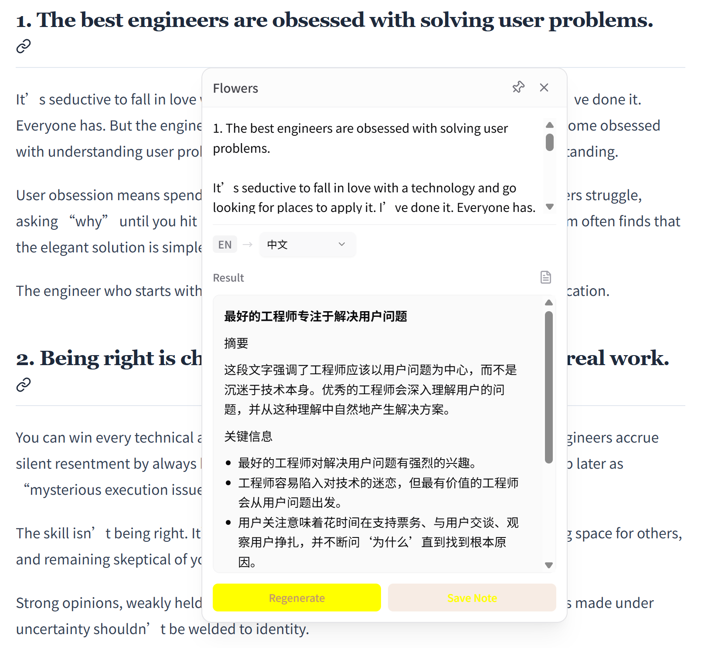

# 🌸 Flowers

<div align="center">

**An intelligent browser extension for AI-powered translation, polishing, note-taking, and knowledge management**

[](./LICENSE)
[]()
[](https://www.typescriptlang.org/)
[](https://react.dev/)
[](https://nodejs.org/)

[English](./README.md) | [简体中文](./README.zh-CN.md)

</div>

---

## ✨ Features

### 🎯 Core Capabilities

- **🌐 Smart Translation** - Context-aware translation with editable terminology
- **✨ AI Polish** - Professional text refinement with multiple tone options
- **📝 Note Generation** - Auto-generate structured notes from web content
- **💬 RAG-Powered Chat** - Ask questions grounded in your personal knowledge base
- **🎨 Customizable Prompts** - Edit and manage AI prompts for each workflow
- **🔄 Multi-Device Sync** - Keep your notes synchronized across devices

### 🚀 Highlights

- **Popup on Selection** - Instant AI tools when you highlight text
- **Side Panel Workspace** - Integrated chat, notes, and settings
- **Local-First** - Your data stays on your device
- **Privacy-Focused** - No data collection, no tracking
- **Extensible** - Plugin architecture for custom workflows
- **Language-Aware Prompts** - Translation/Polish prompts automatically switch to the language you set in Settings

---

## 📸 Screenshots

### 🌐 Smart Translation

Select any text on a webpage and instantly translate it with context-aware AI translation.


### 💬 RAG-Powered Chat

Ask questions grounded in your personal knowledge base. The AI retrieves relevant context from your notes to provide accurate answers.


### 📝 Note Generation

Automatically generate structured notes from web content with AI-powered summarization and key information extraction.


### 📚 Note Management

Browse, search, and manage your notes with tags, calendar view, and full-text search capabilities.



---

## 🎬 Experimental: Video Subtitle Translation

> 💡 **Want real-time video subtitle translation?** Check out the [`video` branch](https://github.com/snailfrying/flowers/tree/video)!

The `video` branch includes an experimental feature for translating video subtitles in real-time on YouTube and other platforms. Features include auto-detection of subtitles, in-player toggle button, smart batching, and stylish overlay display.

```bash
# To try the video subtitle translation feature:
git checkout video
```


---

## 🏗️ Architecture

```
┌─────────────────────────────────────────────────────────┐
│                     Browser Extension                    │
├──────────────────┬──────────────────┬───────────────────┤
│   Content Script │   Side Panel     │  Service Worker   │
│   (Selection UI) │   (Workspace)    │  (API Bridge)     │
└────────┬─────────┴────────┬─────────┴─────────┬─────────┘
         │                  │                   │
         └──────────────────┼───────────────────┘
                            │
                    ┌───────▼────────┐
                    │  Backend Layer │
                    ├────────────────┤
                    │  • LLM Client  │
                    │  • RAG Engine  │
                    │  • Storage     │
                    │  • Sync        │
                    └────────────────┘
```

---

## 🚀 Quick Start

### Prerequisites

- **Node.js** >= 18.0.0
- **npm** or **pnpm**
- **OpenAI-compatible API** key

### Installation

1. **Clone the repository**

   ```bash
   git clone https://github.com/snailfrying/flowers.git
   cd flowers
   ```

2. **Install dependencies**

   ```bash
   # Backend
   cd backend
   npm install

   # Frontend
   cd ../frontend
   npm install
   ```

3. **Configure API keys**

   ```bash
   # Copy example config
   cp backend/env.yaml.example backend/env.yaml
   
   # Edit with your API key
   # vim backend/env.yaml
   ```

4. **Build the extension**

   ```bash
   # Build backend
   cd backend
   npm run build

   # Build frontend
   cd ../frontend
   npm run build
   ```

5. **Load in browser**
   - Open `chrome://extensions/`
   - Enable "Developer mode"
   - Click "Load unpacked"
   - Select `frontend/dist/` directory

---

## 📖 Usage

### Text Selection Tools

1. Highlight any text on a webpage
2. Click the Flowers icon in the popup
3. Choose from:
   - **Translate** - Translate to your target language
   - **Polish** - Refine and improve the text
   - **Generate Note** - Create a structured note
   - **Ask AI** - Get AI insights about the selection

### Side Panel Workspace

1. Click the Flowers extension icon
2. Access three main sections:
   - **💬 Chat** - Converse with AI using your knowledge base
   - **📝 Notes** - Browse and manage your notes
   - **⚙️ Settings** - Configure models, prompts, and preferences

### Note Management

- **Create**: Generate notes from web content or manual input
- **Edit**: Modify titles, content, and tags (generated notes always keep original facts and links)
- **Search**: Find notes by keywords or tags
- **Export**: Download as Markdown or JSON
- **Calendar Filter**: Calendar view highlights dates that contain notes so you can filter with a single click

---

## 🛠️ Development

### Project Structure

```
flowers/
├── backend/          # AI orchestration layer
│   ├── src/
│   │   ├── agent/   # Workflow nodes
│   │   ├── services/# LLM, RAG, prompts
│   │   └── storage/ # Data persistence
│   └── package.json
│
├── frontend/         # Browser extension UI
│   ├── src/
│   │   ├── components/  # React components
│   │   ├── background/  # Service worker
│   │   ├── content/     # Content scripts
│   │   └── sidepanel/   # Main workspace
│   └── package.json
│
├── LICENSE
└── README.md
```

### Development Mode

```bash
# Backend (watch mode)
cd backend
npm run dev

# Frontend (with HMR)
cd frontend
npm run dev
```

### Testing

```bash
# Run tests
npm run test

# Run linter
npm run lint
```

---

## 🤝 Contributing

We welcome contributions! Please see our [Contributing Guide](./CONTRIBUTING.md) for details.

### Quick Contribution Steps

1. Fork the repository
2. Create a feature branch (`git checkout -b feat/amazing-feature`)
3. Commit your changes (`git commit -m 'feat: add amazing feature'`)
4. Push to the branch (`git push origin feat/amazing-feature`)
5. Open a Pull Request

---

## 📋 Roadmap

- [ ] Firefox extension support
- [ ] Local LLM integration (Ollama, LM Studio)
- [ ] Prompt version control
- [ ] Multi-language prompt templates
- [ ] Advanced RAG features (hybrid search, re-ranking)
- [ ] Mobile companion app
- [ ] Plugin marketplace

---

## ❓ FAQ

<details>
<summary><b>Q: Is my data sent to external servers?</b></summary>

A: Only AI API calls (to OpenAI or your configured provider) are sent externally. All notes and settings are stored locally in your browser.
</details>

<details>
<summary><b>Q: Can I use this with local LLMs?</b></summary>

A: Yes! Configure any OpenAI-compatible API endpoint in settings. Works with Ollama, LM Studio, and other local inference servers.
</details>

<details>
<summary><b>Q: How do I customize prompts?</b></summary>

A: Go to Settings → Prompt Management. You can edit system prompts for each workflow (translation, polish, note generation, etc.).
</details>

<details>
<summary><b>Q: Can I export my notes?</b></summary>

A: Yes! Use the Export button in the Notes page to download all notes as Markdown or JSON.
</details>

---

## 📄 License

This project is licensed under the **Personal Use Non-Commercial License**.

- ✅ Personal use
- ✅ Modification and distribution (non-commercial)
- ❌ Commercial use
- ❌ Selling or monetizing

See [LICENSE](./LICENSE) for full details.

---

## 🙏 Acknowledgments

- Built with [React](https://react.dev/), [TypeScript](https://www.typescriptlang.org/), and [Tailwind CSS](https://tailwindcss.com/)
- UI components from [shadcn/ui](https://ui.shadcn.com/)
- Icons from [Lucide](https://lucide.dev/)

---

## 📞 Contact & Support

- **Issues**: [GitHub Issues](https://github.com/snailfrying/flowers/issues)
- **Discussions**: [GitHub Discussions](https://github.com/snailfrying/flowers/discussions)
- **Email**: <snailfryiing@gmail.com>

---

<div align="center">

**Made with 💜 by the Flowers Team**

[⬆ Back to Top](#-flowers)

</div>
