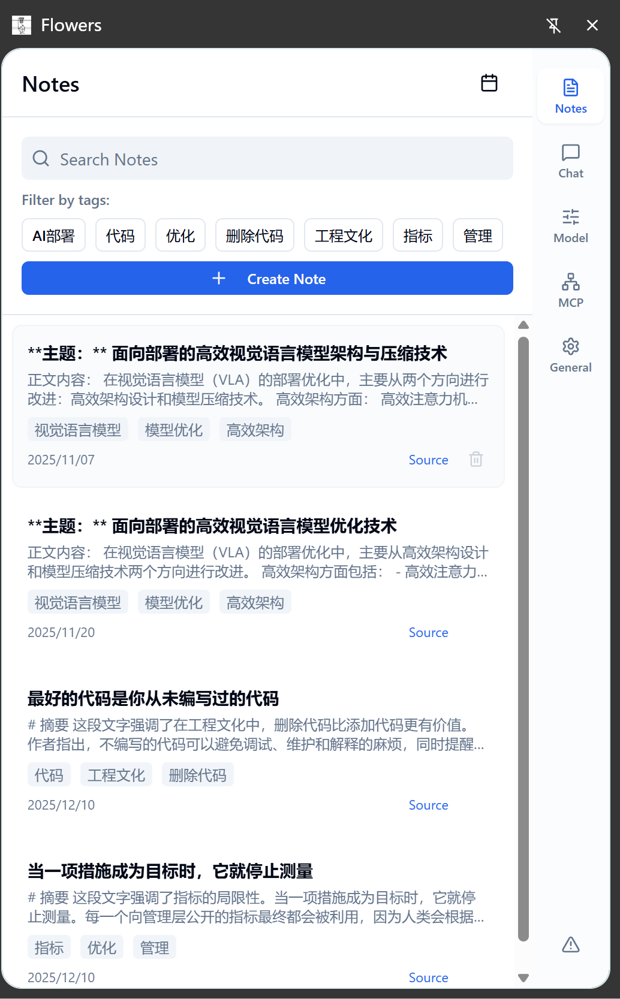

# 🌸 Flowers

<div align="center">

**智能浏览器扩展 - AI 驱动的翻译、润色、笔记和知识管理工具**

[](./LICENSE)
[]()
[](https://www.typescriptlang.org/)
[](https://react.dev/)
[](https://nodejs.org/)

[English](./README.md) | [简体中文](./README.zh-CN.md)

</div>

---

## 📺 演示视频

<div align="center">
  <video src="./docs/screenshots/flowers_8mb.mp4" width="100%" controls autoplay loop muted></video>
  <p><i>体验 Flowers 带来的无缝 AI 增强工作流</i></p>
</div>

---

## ✨ 功能特性

### 🎯 核心能力

- **🌐 智能翻译** - 基于上下文的精准翻译，支持术语编辑
- **✨ AI 润色** - 多种语气的专业文本优化
- **📝 笔记生成** - 自动从网页内容生成结构化笔记
- **💬 RAG 问答** - 基于个人知识库的智能对话
- **🎨 自定义提示词** - 为每个工作流编辑和管理 AI 提示词
- **🔄 多设备同步** - 跨设备同步您的笔记
- **🎬 视频字幕翻译** - 在 YouTube 等平台上实时 AI 翻译视频字幕
- **🌐 全文翻译** - 支持**技术内容保护**（跳过代码/公式/图表）与**智能批处理**的双语对照模式

### 🚀 亮点

- **划词弹窗** - 选中文本即可使用 AI 工具
- **侧边栏工作区** - 集成聊天、笔记和设置
- **本地优先与隐私** - 所有笔记和设置均存储在浏览器本地。不收集数据，不追踪行为。
- **可扩展架构** - 基于插件的系统，支持自定义 AI 工作流
- **语言自适应提示词** - 智能提示词切换，确保 AI 输出与您设置的界面语言一致
- **双语对照翻译** - 专业级全文翻译，支持技术内容保护

---

## 📸 界面预览

### 🌐 智能翻译

在网页上选中任意文本，即可获得基于上下文的 AI 智能翻译。


### 🌐 全文翻译

将整个网页翻译为双语对照格式。不同于通用翻译工具，Flowers 专为开发者和深度用户设计：

- **🛡️ 技术内容保护**：自动识别并跳过代码块 (`<pre>`, `<code>`)、数学公式 (KaTeX, MathJax) 以及流程图 (Mermaid)，确保技术文档的严谨性。
- **🧠 上下文感知批处理**：智能合并多个段落进行单次 API 请求，在保持上下文连贯性的同时，显著降低 Token 消耗和响应延迟。
- **💉 非侵入式注入**：采用独特的 DOM 注入技术，完整保留原网页结构与事件监听器，完美兼容复杂的单页应用 (SPA)。
- **🔄 动态内容监听**：实时监控 DOM 变化（通过 MutationObserver），自动翻译新加载的内容（如无限滚动页面）。


### 🎬 视频字幕翻译

Flowers 包含高性能的实时视频字幕翻译功能。主要特性：


- **🎯 自动检测** - 自动检测 YouTube 等平台上有字幕的视频
- **🔘 开关按钮** - 播放器内的开关按钮，用于启用/禁用翻译
- **📝 实时批处理** - 智能缓冲并批量处理流式字幕，确保在快速对话中不丢失上下文。
- **🎨 叠加显示** - 在视频上以美观、非遮挡的叠加层显示翻译字幕。
- **⚡ 缓存与同步** - 缓存翻译结果以避免冗余调用，并自动同步设置中的首选语言。

#### 支持的平台

| 平台 | 字幕来源 | 状态 |
|---------|--------|------|
| YouTube | DOM 字幕 | ✅ 已支持 |
| YouTube | TextTrack API | ✅ 已支持 |
| 通用 | TextTrack API | ✅ 已支持 |
| Netflix | - | 🚧 计划中 |

#### 使用方法

1. 导航到已启用字幕的 YouTube 视频
2. 在视频播放器控件中找到 **🌐 翻译** 图标
3. 点击图标启用实时字幕翻译
4. 翻译字幕将以黄色叠加层显示在原始字幕上方

### 💬 RAG 问答

基于个人知识库进行智能对话。AI 会从您的笔记中检索相关上下文，提供准确的答案。


### 📝 笔记生成

从网页内容自动生成结构化笔记，支持 AI 摘要和关键信息提取。



### 📚 笔记管理

浏览、搜索和管理您的笔记，支持标签筛选、日历视图和全文搜索。


---

## 🏗️ 系统架构

```
┌─────────────────────────────────────────────────────────┐
│                     浏览器扩展                           │
├──────────────────┬──────────────────┬───────────────────┤
│   (划词 UI)      │   (工作区)       │  (API 桥接)       │
│   (视频翻译)     │                  │                   │
│   (全文翻译)     │                  │                   │
└────────┬─────────┴────────┬─────────┴─────────┬─────────┘
         │                  │                   │
         └──────────────────┼───────────────────┘
                            │
                    ┌───────▼────────┐
                    │   后端服务层    │
                    ├────────────────┤
                    │  • LLM 客户端  │
                    │  • RAG 引擎    │
                    │  • 存储层      │
                    │  • 同步服务    │
                    └────────────────┘
```

---

## 🚀 快速开始

### 环境要求

- **Node.js** >= 18.0.0
- **npm** 或 **pnpm**
- **OpenAI 兼容** API 密钥

### 安装步骤

1. **克隆仓库**

   ```bash
   git clone https://github.com/snailfrying/flowers.git
   cd flowers
   ```

2. **安装依赖**

   ```bash
   # 后端
   cd backend
   npm install

   # 前端
   cd ../frontend
   npm install
   ```

3. **配置 API 密钥**

   ```bash
   # 复制示例配置
   cp backend/env.yaml.example backend/env.yaml
   
   # 编辑配置文件，填入您的 API 密钥
   # vim backend/env.yaml
   ```

4. **构建扩展**

   ```bash
   # 构建后端
   cd backend
   npm run build

   # 构建前端
   cd ../frontend
   npm run build
   ```

5. **加载到浏览器**
   - 打开 `chrome://extensions/`
   - 启用"开发者模式"
   - 点击"加载已解压的扩展程序"
   - 选择 `frontend/dist/` 目录

---

## 📖 使用指南

### 划词工具

1. 在网页上选中任意文本
2. 点击弹出的 Flowers 图标
3. 选择功能:
   - **翻译** - 翻译到目标语言
   - **润色** - 优化和改进文本
   - **生成笔记** - 创建结构化笔记
   - **AI 提问** - 获取 AI 对选中内容的见解

### 侧边栏工作区

1. 点击 Flowers 扩展图标
2. 访问三个主要部分:
   - **💬 聊天** - 使用知识库与 AI 对话
   - **📝 笔记** - 浏览和管理笔记
   - **⚙️ 设置** - 配置模型、提示词和偏好设置

### 笔记管理

- **创建**: 从网页内容生成或手动输入
- **编辑**: 修改标题、内容和标签（生成的笔记会严格保留事实与链接）
- **搜索**: 通过关键词或标签查找笔记
- **导出**: 下载为 Markdown 或 JSON 格式
- **日历筛选**: 日历视图会在有笔记的日期显示标记，可一键筛选指定日期的笔记

---

## 🛠️ 开发指南

### 项目结构

```
flowers/
├── backend/          # AI 编排层
│   ├── src/
│   │   ├── agent/   # 工作流节点
│   │   ├── services/# LLM, RAG, 提示词
│   │   └── storage/ # 数据持久化
│   └── package.json
│
├── frontend/         # 浏览器扩展 UI
│   ├── src/
│   │   ├── components/  # React 组件
│   │   ├── background/  # Service Worker
│   │   ├── content/     # 内容脚本
│   │   │   └── video/   # 视频字幕翻译
│   │   │       ├── VideoSubtitleDetector.ts      # 视频字幕检测器
│   │   │       ├── SubtitleExtractor.ts          # 字幕提取器
│   │   │       ├── SubtitleTranslator.ts         # 字幕翻译器
│   │   │       ├── SubtitleOverlayRenderer.ts    # 字幕叠加渲染器
│   │   │       ├── SubtitleToggleButton.ts       # 字幕开关按钮
│   │   │       └── VideoSubtitleTranslationManager.ts  # 统一管理器
│   │   │   └── fullpage/# 全文翻译
│   │   │       ├── NodeSelector.ts               # 节点选择器
│   │   │       ├── BatchProcessor.ts             # 批处理器
│   │   │       ├── DOMInjector.ts                # DOM 注入器
│   │   │       ├── DynamicContentObserver.ts     # 动态内容监听器
│   │   │       ├── FloatingButton.ts             # 悬浮按钮
│   │   │       └── FullPageTranslationManager.ts # 全文翻译管理器
│   │   └── sidepanel/   # 主工作区
│   └── package.json
│
├── LICENSE
└── README.md
```

### 开发模式

```bash
# 后端 (监听模式)
cd backend
npm run dev

# 前端 (热重载)
cd frontend
npm run dev
```

### 测试

```bash
# 运行测试
npm run test

# 运行代码检查
npm run lint
```

---

## 🤝 参与贡献

我们欢迎贡献！请查看我们的[贡献指南](./CONTRIBUTING.md)了解详情。

### 快速贡献步骤

1. Fork 本仓库
2. 创建功能分支 (`git checkout -b feat/amazing-feature`)
3. 提交更改 (`git commit -m 'feat: 添加某个功能'`)
4. 推送到分支 (`git push origin feat/amazing-feature`)
5. 开启 Pull Request

---

## 📋 路线图

- [ ] Firefox 扩展支持
- [ ] 本地 LLM 集成 (Ollama, LM Studio)
- [ ] 提示词版本控制
- [ ] 多语言提示词模板
- [ ] 高级 RAG 功能 (混合搜索、重排序)
- [ ] 移动端配套应用
- [ ] 插件市场

---

## ❓ 常见问题

<details>
<summary><b>Q: 我的数据会被发送到外部服务器吗？</b></summary>

A: 只有 AI API 调用（发送到 OpenAI 或您配置的提供商）会发送到外部。所有笔记和设置都存储在您的浏览器本地。
</details>

<details>
<summary><b>Q: 可以使用本地 LLM 吗？</b></summary>

A: 可以！在设置中配置任何 OpenAI 兼容的 API 端点。支持 Ollama、LM Studio 和其他本地推理服务器。
</details>

<details>
<summary><b>Q: 如何自定义提示词？</b></summary>

A: 进入 设置 → 提示词管理。您可以编辑每个工作流（翻译、润色、笔记生成等）的系统提示词。
</details>

<details>
<summary><b>Q: 可以导出笔记吗？</b></summary>

A: 可以！使用笔记页面的导出按钮，将所有笔记下载为 Markdown 或 JSON 格式。
</details>

---

## 📄 许可证

本项目采用 **个人使用非商业许可证**。

- ✅ 个人使用
- ✅ 修改和分发（非商业）
- ❌ 商业用途
- ❌ 出售或盈利

详见 [LICENSE](./LICENSE) 文件。

---

## 🙏 致谢

- 使用 [React](https://react.dev/)、[TypeScript](https://www.typescriptlang.org/) 和 [Tailwind CSS](https://tailwindcss.com/) 构建
- UI 组件来自 [shadcn/ui](https://ui.shadcn.com/)
- 图标来自 [Lucide](https://lucide.dev/)

---

## 📞 联系与支持

- **问题反馈**: [GitHub Issues](https://github.com/snailfrying/flowers/issues)
- **讨论区**: [GitHub Discussions](https://github.com/snailfrying/flowers/discussions)
- **邮箱**: <snailfrying@gmail.com>

---

<div align="center">

**用 💜 制作 by Flowers 团队**

[⬆ 回到顶部](#-flowers)

</div>
